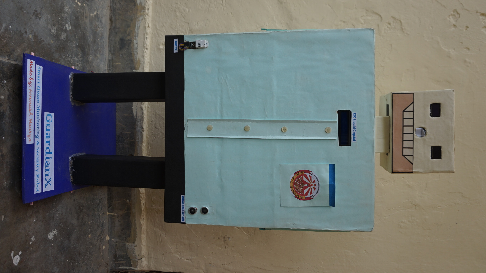

# GuardianX: Smart Home Robot 🤖

**GuardianX** is an intelligent, multi-brained smart home security and automation robot. It doesn't just watch—it **sees, thinks, and protects**. By combining real-time environmental monitoring, live video surveillance, remote appliance control, and emotional expressions, GuardianX serves as an active digital guardian for the modern household.

---

## 📌 Project Overview
Every day, modern households face security threats, hidden environmental dangers (like gas leaks or electrical faults), and avoidable energy wastage. GuardianX solves these problems by providing:
* **Active Protection:** Continuous environmental and perimeter sensing.
* **Smart Monitoring:** High-definition video streaming accessible from anywhere.
* **Energy Management:** Remote appliance switching over a local web dashboard.
* **Interactive Design:** Emotional intelligence via expressive OLED "eyes" to communicate safety statuses intuitively.

---

## 🧠 System Architecture & "Three-Brain" Layout
GuardianX utilizes a distributed computing architecture split across three dedicated controllers to manage processing, sensing, and human-robot interaction seamlessly.

```
                    ┌─────────────────────────────┐
                    │        LINUX SERVER         │
                    │    (Ubuntu/Mint • Python)   │
                    └───────────── ┬ ─────────────┘
                                   │ USB Serial + Websocket/HTTP
                                   ▼
                    ┌─────────────────────────────┐
                    │         ARDUINO UNO         │
                    └───── ┬ ───────────── ┬ ─────┘
              ┌────────────┘               └────────────┐
              ▼                                         ▼
      ┌───────────────┐                         ┌───────────────┐
      │  MOTOR DRIVER │                         │    SERVOS     │
      │ (L298N/L293D) │                         │  (Arm, Neck)  │
      └───────────────┘                         └───────────────┘
              │                                         │
              ▼                                         ▼
      ┌───────────────┐                         ┌───────────────┐
      │  ULTRASONIC   │                         │     DHT22     │
      │   (HC-SR04)   │                         │(Temp+Humidity)│
      └───────────────┘                         └───────────────┘
              │
              ▼
      ┌───────────────┐
      │    MQ-135     │
      │ (Air Quality) │
      └───────────────┘
```

### 1. The Command Center (Mini Computer / Linux OS)
* **Role:** The primary processor and AI decision-making hub.
* **Functions:** Hosts the interactive Web Dashboard, handles real-time video capture and streaming, and orchestrates low-level controllers.
* **Languages:** Python, HTML, CSS, JavaScript.

### 2. The Sentinel (Arduino Uno)
* **Role:** The sensory and motor nervous system.
* **Functions:** Constantly polls safety/environmental sensors and directly regulates heavy-current drive motors and positional servos.

### 3. The Personality (ESP32)
* **Role:** The emotional interface.
* **Functions:** Controls dual 0.96" OLED screens displaying responsive "eyes" that visually shift shape depending on environmental threat profiles.

---

## 🔄 Signal & Data Flow
1. **Web Dashboard → Linux Server:** Captures user joystick/button inputs for locomotion, servo camera positioning, and operational mode selections.
2. **Linux Server → Camera:** Captures raw frames using OpenCV and dynamically broadcasts a continuous live video feed back to the interface.
3. **Linux Server → Arduino Uno:** Forwards runtime directives via USB Serial (movement vectors, absolute servo target angles, autonomous vs. manual flag).
4. **Arduino Uno → Linux Server:** Streams packaged telemetry frames back to the host machine containing environmental metrics.

---

## 🛠️ Components Checklist

### Microcontrollers & Processing Hubs
* **Mini Computer:** Configured with Linux OS (Ubuntu/Mint) to run core backend servers.
* **Arduino Uno:** Multi-channel real-time I/O management.
* **ESP32:** Dedicated screen and wireless display state controller.

### Sensors & Inputs
* **MQ-135:** Air Quality and hazardous gas leak monitoring.
* **DHT22:** High-accuracy Ambient Temperature & Humidity sensor.
* **HC-SR04 Ultrasonic Sensor:** Range-finding obstacle avoidance matrix.
* **USB WebCam / IP Cam:** Video stream input device.

### Propulsion & Actuation
* **DC Motors (x6) + Matching Wheels (x6):** Rugged 6WD high-traction drive system.
* **Motor Driver (L298N or L293D):** H-Bridge power translation for locomotion.
* **Metal Gear Motor (x1):** High-torque pan/tilt neck assembly.
* **Tower Pro Mini Servos (x4):** Interactive robotic arm manipulation.

### Displays & Feedback
* **0.96" OLED Displays (x2):** Micro-screens for animated digital eye states.
* **LCD I2C Display:** Alphanumeric system health text readout panel.

### Power Management Network
* **19V 3A Main DC Supply:** Core system power entry.
* **15V Power Delivery (PD) Charger:** Specialized runtime charging logic.
* **DC-DC Step-Up Converter (19V rail):** Localized high-voltage power stability.
* **DC-DC Step-Down Converters (12V and 5V rails):** Segregated logic and servo rails.
* **Miniature Circuit Breaker (MCB 1.5A):** Physical overcurrent hardware protection loop.
* **Breadboards (x2):** Shared system-wide power rails and signal tie points.

---

## 💻 Technical Stack
* **Backend Framework:** Python (OpenCV for image processing, Serial for hardware links).
* **Frontend Web Application:** HTML5, CSS3, JavaScript (WebSockets/HTTP protocols).
* **Firmware:** Embedded C++ (Arduino IDE suite).
* **Target Network environment:** Dedicated Local Area Network (LAN) over Wi-Fi Router.

---

## 🚀 Live Demonstration Features
* **Global Surveillance:** Crystal-clear low-latency dashboard streaming.
* **Remote Appliance Switching:** Dynamic relay/appliance toggling from the UI.
* **Threat Mitigation:** Instantaneous notifications triggered upon detection of localized smoke or gas breaches.
* **Affective Feedback:** The robot switches fluidly between a **Happy State** (Secure environment) and an **Alert State** (Hazards detected) using its dual OLED displays.


